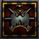
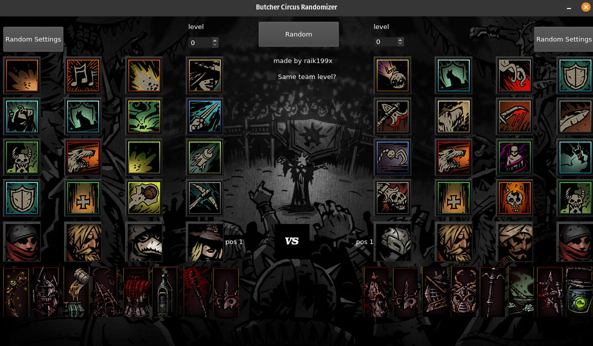

# Butcher circus randomize

<p align="center">
  
</p>

## About

Simple randomize with ui that was written on Qt

Supports hero + trinkets (with level restriction) randomization on both, Linux and Windows systems.

You can use it for fun evening in [darkest dungeon](https://store.steampowered.com/app/262060/Darkest_Dungeon/)

## Installation

### Linux

1. Unarchive *LinuxInstaller.zip*
2. write ```chmod +x InstallerButcher_Circus_Randomizer.run```
3. ```./InstallerButcher_Circus_Randomizer.run```
4. Run through simple installation.

### Windows

1. Unarchive *WindowsInstaller.zip*
2. *Optional* if you don't have installed before **vcredist_msvc2019_x64.exe** install it now.
3. Run *InstallerButcher_Circus_Randomizer.exe* and complete through simple installation.

## Screenshots



## Thanks

[1_1sundial](https://www.reddit.com/user/1_1sundial/) for inspiration

[Milky Cookie](https://github.com/MilkyCookie1to2) with helping porting it on windows

[Maragnarok](https://steamcommunity.com/profiles/76561198809193760) for info about 0-level trinkets
