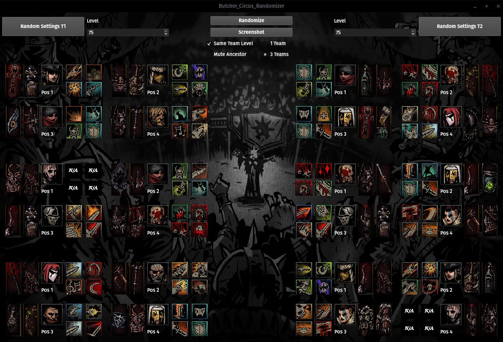
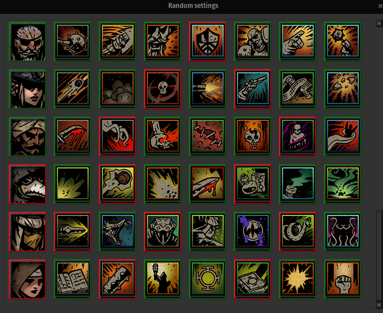
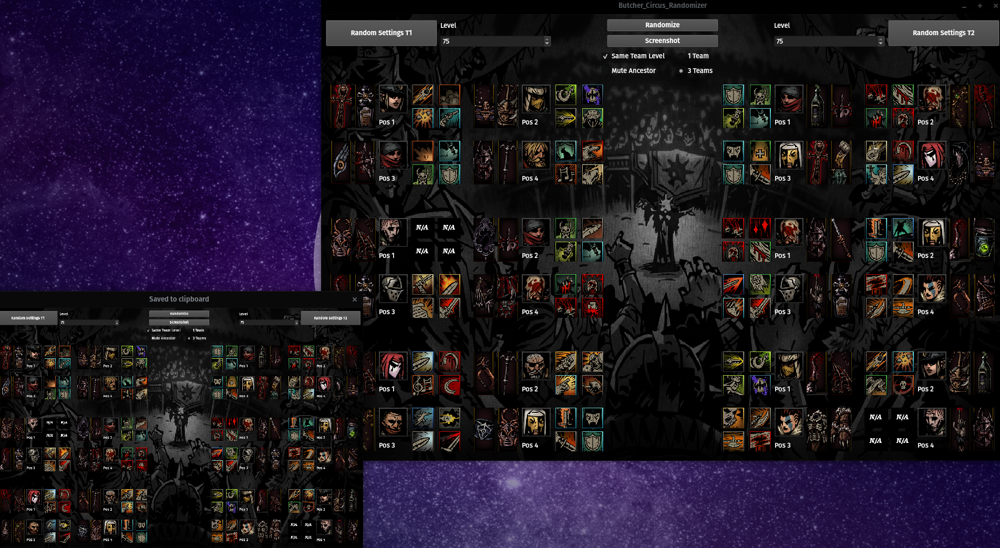

# Butcher circus randomize

<p align="center">
  
</p>

## About

Simple randomize with ui that was written on Qt

Supports hero + trinkets (with level restriction) randomization on both, Linux and Windows systems.

You can use it for fun evening in [darkest dungeon](https://store.steampowered.com/app/262060/Darkest_Dungeon/)

## Installation

### Linux

1. write ```chmod +x CircusRandomizerInstaller```
2. ```./CircusRandomizerInstaller``` and run through simple installation.

### Windows

1. Run *CircusRandomizerInstaller.exe* and complete through simple installation.

### Building from sources (Linux)

0. To build from sources, you need to install Qt. You should also install vcpkg if you want to build tests.
1. ```git clone https://github.com/raik199x/Butcher-circus-randomizer```
2. ```cd Butcher-circus-randomizer```
3. (optional, tests) ```vcpkg install```
4. ```cmake -S . -B build -DCMAKE_BUILD_TYPE=Debug/Release```

## Screenshots








## Thanks

[1_1sundial](https://www.reddit.com/user/1_1sundial/) for inspiration

[Milky Cookie](https://github.com/MilkyCookie1to2) with helping porting it on windows (old version)

[Maragnarok](https://steamcommunity.com/profiles/76561198809193760) for info about 0-level trinkets

[Some reddit guy that extracted all DD sounds](https://www.reddit.com/r/darkestdungeon/comments/8pv69v/heres_all_of_the_dd_sounds_extracted_as_wav_files/)
